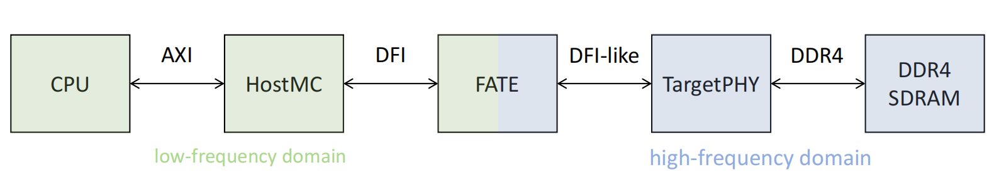
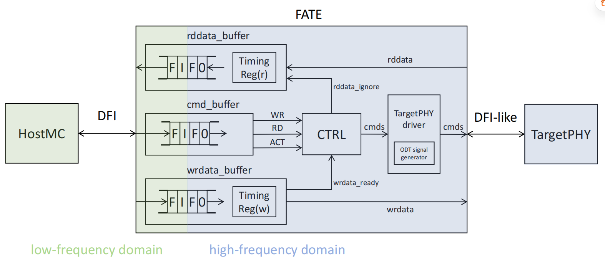
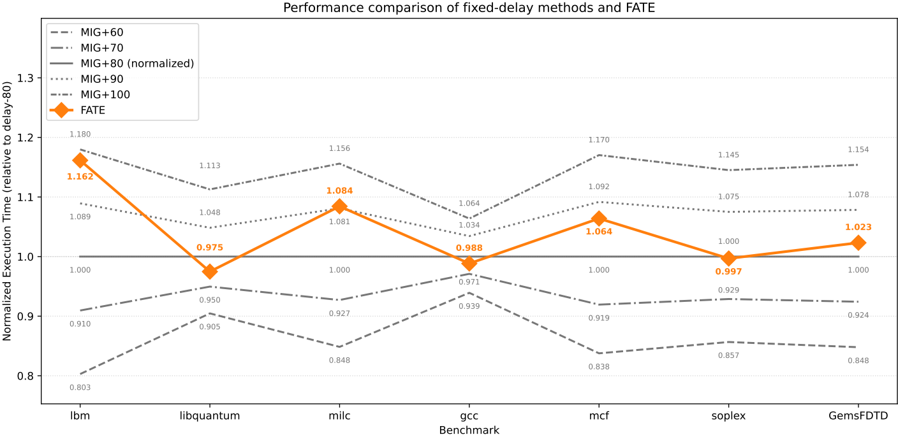

# FATE: FPGA-based Frequency-Adaptive Timing-Accurate DDR PHY Emulator

> For the Chinese version, see [README_zh.md](./README_zh.md).

[TOC]

## Overview

FATE is an FPGA-based DDR PHY emulator. It is primarily used for FPGA-based pre-silicon performance evaluation of processors, calibrating performance evaluation results on FPGA platforms by accurately reproducing the timing relationship between the CPU and the memory subsystem. It connects the MC's DFI interface to a high-speed DDR PHY interface on the FPGA (e.g., Xilinx MIG PHY), and while preserving the DFI protocol semantics, it achieves frequency-adaptive and cycle-accurate memory behavior emulation.

> Naming note:
> During early development and internal engineering, this project used the codename FAMSE, and the source code contains many module names such as famsev2. FAMSE is FATE, and FATE is FAMSE. FATE is the name finalized when the paper was officially published, while FAMSE was the internal codename used earlier. Because the original meaning of FAMSE is no longer suitable for a public project, we uniformly use the name FATE in the public release. The renaming does not affect the understanding or use of the tool.

## Background and Motivation

In the processor design flow, accurate and fast pre-silicon performance evaluation is crucial. Pure software simulation provides high accuracy but extremely low speed, while commercial hardware emulation platforms are fast but very expensive. FPGA-based evaluation approaches offer the ability to run full workloads at an acceptable cost. However, the CPU on an FPGA can only run at relatively low frequencies (typically tens of MHz), while DDR memory must run at hundreds of MHz or even higher due to physical-layer constraints. This frequency mismatch causes memory access latency to appear significantly shorter relative to the CPU, making the memory behave like a huge cache and severely distorting performance measurements.

FATE solves this problem in the following ways:

- Inserting a transparent DFI-to-DFI conversion layer between HostMC and TargetPHY;

- Proxying refresh, ZQ calibration, and TargetPHY-specific VTT operations in FATE;

- Converting HostMC read/write requests into ACT–RD–PRE / ACT–WR–PRE sequences, keeping rows closed by default;

- Proving through rigorous timing analysis that DFI protocol timing constraints can still be met in the worst case.

Experimental results show that FATE achieves cycle-level timing accuracy and can stably run the complete SPEC CPU 2006 benchmark suite on FPGA.

## Main Features

- Cycle-accurate timing: Compared with a commercial MC-PHY, 10K sequential, random, and trace read/write operations all achieve 0% cycle difference.

- Frequency adaptation: Supports stable operation of HostMC at up to 10 MHz (using DDR4-1600, DFI 1:4 as an example).

- Full-system validation: Integrated into an SoC containing a XiangShan processor and a commercial memory controller, successfully running the complete SPEC CPU 2006 suite.

- Extremely low resource overhead: On a Xilinx VU19P, LUT/FF utilization is below 1%, BRAM is about 5.8%, and no DSPs are used.

- Easy integration: Provides a standard DFI 3.1-compliant interface and can be embedded into existing SoC designs as a lightweight IP.

## Architecture Overview

FATE adopts a cross-clock-domain design and is divided into a low-frequency domain and a high-frequency domain, which communicate through asynchronous FIFOs for command and data transfer.

### Low-Frequency Domain

- Connects to the HostMC DFI interface and acts as a logical PHY;

- Receives DFI commands from the HostMC; only RD, WR, and ACT are forwarded, and the remaining commands are discarded;

- Read data, write data, and commands are buffered separately through independent asynchronous FIFOs;

### High-Frequency Domain

- Connects to the TargetPHY DFI-like interface and acts as a logical MC.

- `cmd_buffer`: Parses DFI commands from the HostMC and handles cross-clock synchronization issues.

- `wrdata_buffer`: Concatenates 256-bit DFI write data into 512-bit MIG write data and handles cross-clock synchronization issues.

- `rddata_buffer`: Splits 512-bit MIG read data into 256-bit DFI read data and handles cross-clock synchronization issues.

- `famsev2_ctrl`: Core scheduling state machine responsible for command arbitration, including REF/ZQ/VTT timing, ACT/RD/WR processing and scheduling.

- `mig_phy_driver`: Translates internal commands into the 16-bit control signal format required by the MIG PHY (only slot0 is used).

## Repository Structure

    doc/            # Module-level design documentation
    fifos/          # Simulation test environment for the FIFOs required by FATE
    tcl/            # Tcl scripts for the IPs required by FATE
    vsrc/           # FATE source code
    wrapper/        # Reference code for the FATE wrapper
    LICENSE.txt     # Open-source license
    README_zh.md    # Chinese version of this document
    README.md       # This document

## Environment Dependencies

- FPGA platform: AMD Virtex™ UltraScale+™ VU19P FPGA

- EDA tool: Vivado 2024.2

- Simulator：VCS

- TargetPHY: Xilinx MIG IP（PHY-Only mode）

- HostMC: Any memory controller IP compliant with DFI 3.1

## Deployment Instructions

### Instantiating the Required IPs

In your project, instantiate the IPs required by FATE. Use Vivado 2024.2 to execute the `tcl/ip_export_mig_phy.tcl` script, which will generate a MIG PHY IP that meets the requirements. In addition, the other three Tcl scripts in the `tcl/` directory are used for instantiating ILAs and are also recommended.

### Instantiating FATE

In your project, instantiate famsev2_top and connect the DFI interface to the MIG PHY interface. The following is a key connection example (pseudocode):

    famsev2_top u_fate (
        .dfi_clk          (host_dfi_clk),
        .mig_clk          (mig_ui_clk),
        .rst_n            (system_rst_n),
        .calDone          (mig_init_calib_complete),

        // DFI commands
        .dfi_reset_n      (host_dfi_reset_n),
        .dfi_cke          (host_dfi_cke),
        .dfi_odt          (host_dfi_odt),
        .dfi_address      (host_dfi_address),
        .dfi_ba           (host_dfi_ba),
        .dfi_bg           (host_dfi_bg),
        .dfi_cs_n         (host_dfi_cs_n),
        .dfi_act_n        (host_dfi_act_n),
        .dfi_ras_n        (host_dfi_ras_n),
        .dfi_cas_n        (host_dfi_cas_n),
        .dfi_we_n         (host_dfi_we_n),

        // DFI data
        .dfi_wrdata_en    (host_dfi_wrdata_en),
        .dfi_wrdata       (host_dfi_wrdata),
        .dfi_wrdata_mask  (host_dfi_wrdata_mask),
        .dfi_rddata_en    (host_dfi_rddata_en),
        .dfi_rddata       (host_dfi_rddata),
        .dfi_rddata_valid (host_dfi_rddata_valid),

        // MIG PHY commands
        .mc_ACT_n         (mig_mc_act_n),
        .mc_ADR           (mig_mc_adr),
        .mc_BA            (mig_mc_ba),
        .mc_BG            (mig_mc_bg),
        .mc_CKE           (mig_mc_cke),
        .mc_CS_n          (mig_mc_cs_n),
        .mc_ODT           (mig_mc_odt),
        .winRank          (mig_win_rank),
        .mcRdCAS          (mig_rd_cas),
        .mcWrCAS          (mig_wr_cas),
        .mcCasSlot        (mig_cas_slot),
        .mcCasSlot2       (mig_cas_slot2),
        .winBuf           (mig_win_buf),
        .winInjTxn        (mig_win_inj_txn),

        // MIG PHY data
        .mig_rddata_en    (mig_rddata_en),
        .mig_rddata       (mig_rddata),
        .per_rd_done      (mig_per_rd_done),
        .gt_data_ready    (mig_gt_data_ready),
        .mig_wrdata_en    (mig_wrdata_en),
        .mig_wrdata       (mig_wrdata),
        .mig_wrdata_mask  (mig_wrdata_mask)
    );

For more details, refer to the reference code under `wrapper/` or the reference project in the Release.

### Configuration Parameters

The main timing parameters inside FATE are defined as localparam in famsev2_ctrl.v, for example:

- Maintenance operation wait cycles such as WAIT_CNT_REF / WAIT_CNT_ZQS;

- Watchdog overflow thresholds such as REF_WATCH_DOG / ZQS_WATCH_DOG.

These parameters have been optimized based on assumptions of DDR4-1600, DFI 1:4, and a 200 MHz TargetPHY. If the TargetPHY frequency changes, these parameters need to be adjusted accordingly.

### Integration and Verification

It is recommended to first use the provided simple dfi_master or a simple AXI Master + commercial MC for module-level simulation to verify cycle accuracy before deploying to a complete SoC.

### Experiments and Results

The following results are excerpted from the paper; please refer to the paper for details:

- Cycle accuracy: Under 10K sequential, random, and trace access patterns, FATE and a commercial DDR PHY have exactly the same total cycle count (0% difference).

- Stability: Running SPEC CPU 2006 gcc_scilab 15 times on a real FPGA platform, the runtime fluctuation is < 0.04%.

- Full-system correctness: An SoC integrating a XiangShan processor (Kunminghu) and a commercial MC successfully runs the complete SPEC CPU 2006 suite on FPGA without errors.

- Comparison with fixed delay: FATE's performance cannot be matched by any single fixed delay value across all benchmarks, demonstrating the necessity of dynamic timing emulation.

## License

This project is open-sourced under the Mulan PSL v2. See the LICENSE file for details.

## Contact

If you have any questions or suggestions, please email the author at <yecongrong22s@ict.ac.cn> or submit an Issue.
